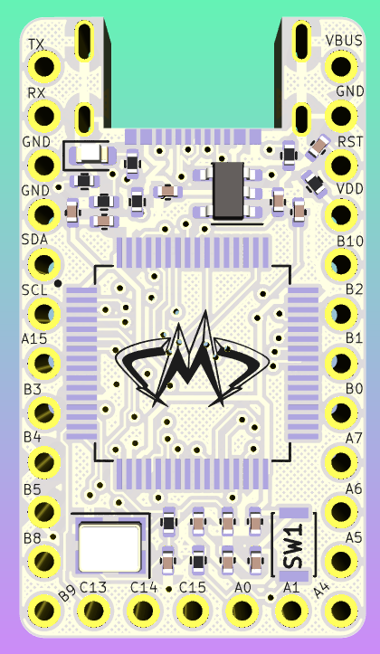

# STeMCell-taxifolia
 STeMCell 1.0.0 but with STM32F401RCT6. Same functionality (almost), but for 5$ less per board.

Original STeMCell made by https://github.com/megamind4089

To use: https://megamind4089.github.io/STeMCell/

Changed nothing except the STM, positioning and silkscreens (still no on-board protections).

Haven't purchased yet, but it should work.

  

